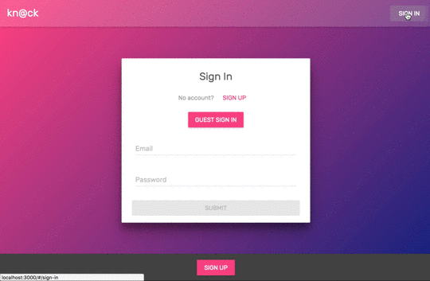
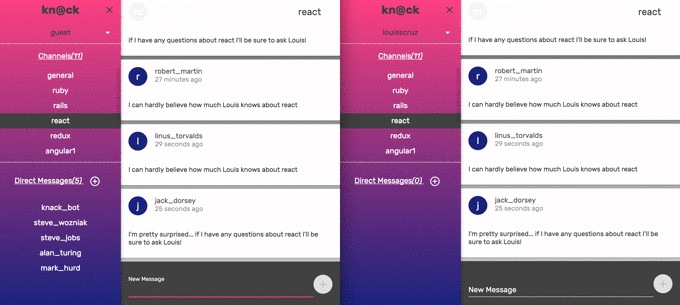
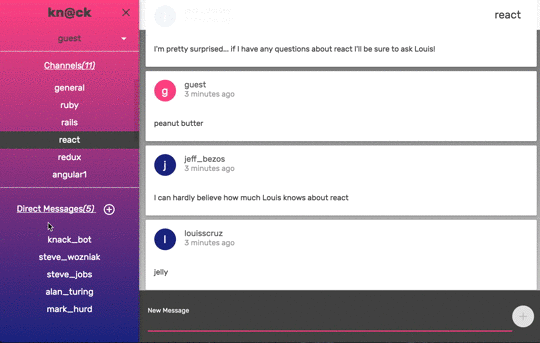

# Knack

Knack is a messaging application much in the style of Slack.

## Features & Implementation

### Guest Sign In

Visitors can easily demo the site through a guest account button. This button sets the form state to the credentials of a demo account and logs the guest in.

### Live chat

Messages are stored at the database level with associated an `author_id` and a `channel_id`. On each visit to a channel, an ActionCable websocket instance is established, and on further reroutes to other channels those connections are destroyed.

### Channels

Messages are organized by their parent Channels. All users can freely join channels.

### Direct messages

Direct messages are channels used for private communication between individuals and groups of individuals. Direct messages can only be seen by users who are members of a given channel. To create a direct message, the user first searches for the individuals of whom the new channel will be comprised. The search makes a debounced request to the server on each keystroke. If a channel currently exists with the chosen members – checked without an HTTP request to the server – the application reroutes to that channel. If a channel does not exists between those members, the channel is created, and the user is redirected to that channel.

### Single page

Knack is a single page app that allows for quick navigation between its various components. As data is fetched from Rails, components are only updated when necessary.

## Future Directions for the Project

Given more time, I would like to implement the following:

### Notifications

On message creation, create a notification for all relevant parties.

### Reactions

Allow for reactions to be associated with messages. Users can add reactions to all messages other than their own.
